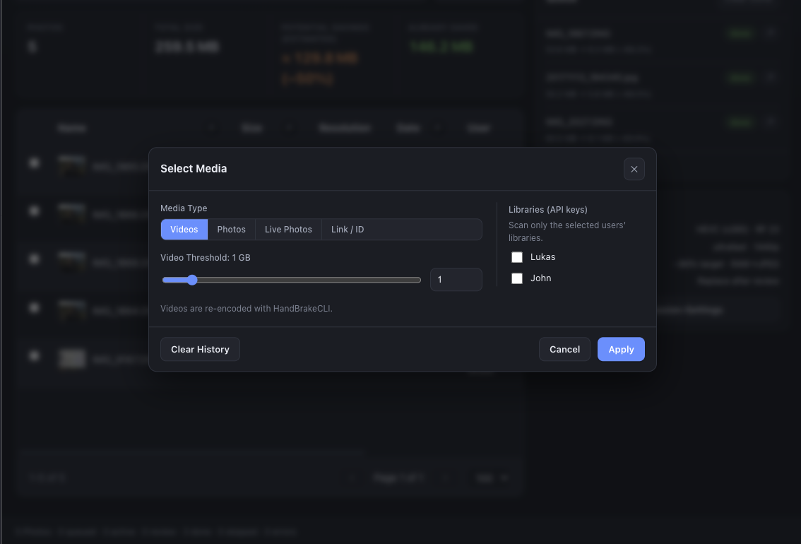
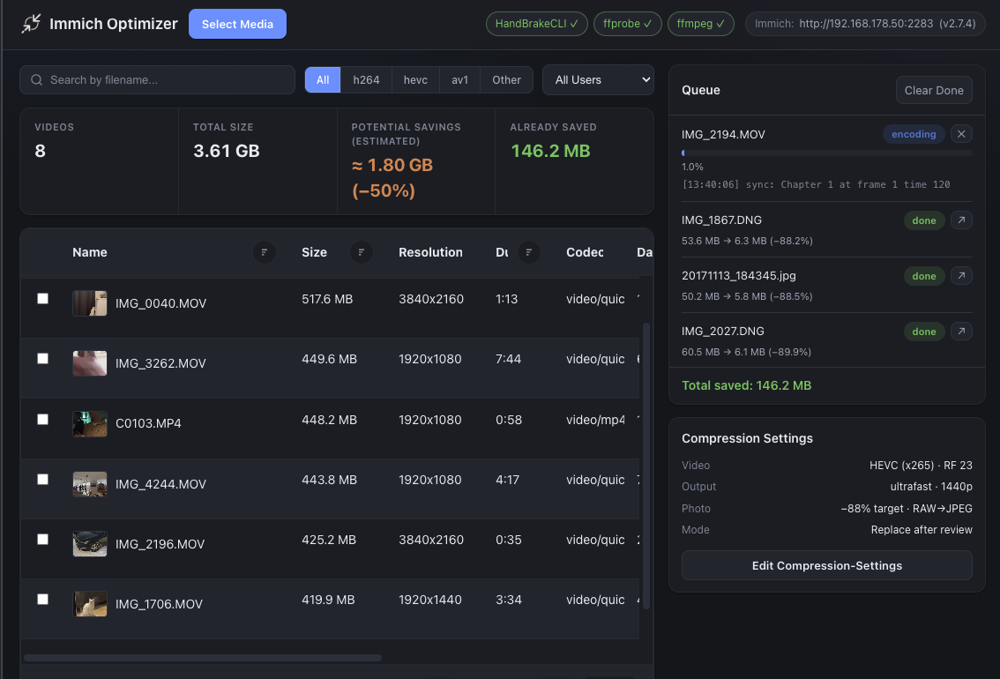
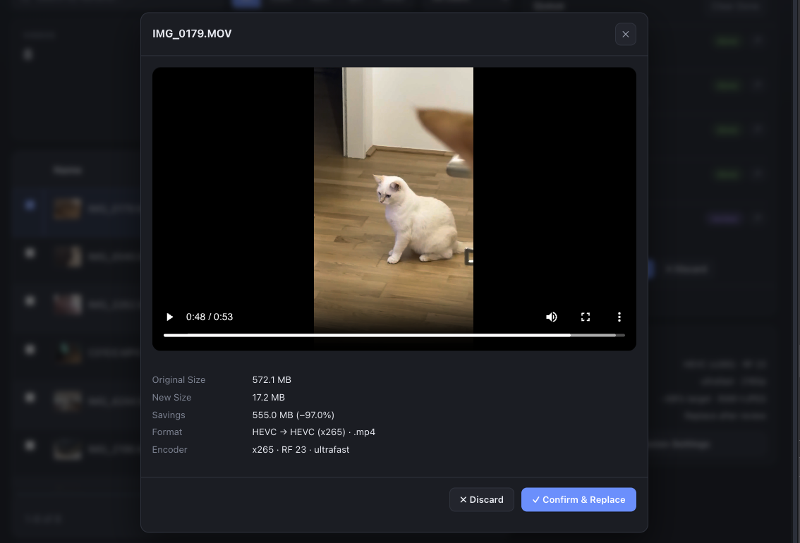

# Immich Recompress

Browse, inspect and **recompress** the videos and photos in your
[Immich](https://immich.app/) library to reclaim storage, all from a small web
dashboard. Re-encode videos with HandBrake, recompress JPEGs with ffmpeg, or
strip the motion clip from Live Photos, with a review-before-replace step and
live progress.

## Screenshots

<p align="center">
  
  
  
</p>

## Features

- Browse videos, photos or Live Photos, filtered by size.
- Re-encode videos (HandBrake: x264 / x265 / AV1, optional resolution cap).
- Hardware (GPU) encoding when available, auto-detected at runtime, plus a
  selectable CPU-core count. See [Hardware acceleration](#hardware-acceleration).
- Recompress JPEGs to a target size (ffmpeg, with a macOS `sips` fallback);
  optional opt-in RAW → JPEG.
- Strip the hidden motion video from Live Photos.
- **Review** the result (new size, savings, preview) before replacing the original.
- Sequential queue with live progress (SSE), proxied thumbnails/downloads and
  persistent job history.

Replacement uploads the compressed file as a new asset, copies the original's
metadata / tags / albums, and moves the original to the Immich trash
(recoverable for the retention period). A local backup is also kept.

[](https://buymeacoffee.com/lukasganster)

## Requirements

- [`HandBrakeCLI`](https://handbrake.fr/) and [`ffmpeg` / `ffprobe`](https://ffmpeg.org/) on `PATH`
- An Immich server (tested with **v2.7.4**) and an **admin** API key
- Docker, or for local dev: Python 3.9+ and Node 22 + [pnpm](https://pnpm.io/)

> **Immich compatibility:** Developed and tested against Immich **2.7.4**. Newer or
> older releases may work but API behaviour can differ — check `/api/status` for the
> detected server version and report issues if something breaks on your version.

## Quick start

> ### ⚠️ Early development
>
> This may still contain bugs, so use it with caution: **I don't guarantee
> against data loss.** Also read [SECURITY.md](SECURITY.md) before exposing it.

### Docker

#### Using the published image (recommended)

A pre-built multi-stage image is published to the GitHub Container Registry on
every release: `ghcr.io/lukasganster/immich-recompress:latest`.

Drop this `docker-compose.yml` somewhere, alongside a `.env` that sets at least
`IMMICH_URL` and `IMMICH_API_KEY` (see [`.env.example`](.env.example)):

```yaml
services:
  immich-recompress:
    image: ghcr.io/lukasganster/immich-recompress:latest
    container_name: immich-recompress
    restart: unless-stopped
    env_file:
      - .env # set IMMICH_URL and IMMICH_API_KEY here
    environment:
      IMMICH_DB: /data/immich_recompress.db
    ports:
      # Bound to 127.0.0.1: this app has NO authentication and can replace/trash
      # Immich media — do not expose it without an authenticating reverse proxy.
      # See SECURITY.md.
      - "127.0.0.1:${PORT:-5050}:${PORT:-5050}"
    volumes:
      - immich-recompress-data:/data # job-history SQLite DB
      - immich-recompress-backups:/tmp/immich_recompress_backup # pre-replace backups
      - immich-recompress-work:/tmp/immich_recompress_ui # download/encode scratch

volumes:
  immich-recompress-data:
  immich-recompress-backups:
  immich-recompress-work:
```

```bash
docker compose up -d
```

For reproducible deploys, pin a version instead of `latest`, e.g.
`ghcr.io/lukasganster/immich-recompress:0.1.0-beta.1`.

#### Building from source

```bash
pnpm run env                    # creates .env; set IMMICH_URL and IMMICH_API_KEY in it
docker compose up -d --build
```

Then open <http://localhost:5050>.

### Local

```bash
# Backend deps: creates .venv and installs requirements.txt
pnpm run setup

# Create .env, then set IMMICH_URL and IMMICH_API_KEY in it
pnpm run env

# Frontend (Angular, pnpm): builds the UI into backend/static
pnpm run install:frontend && pnpm run build:frontend

# Run (serves UI + API on http://127.0.0.1:5050)
pnpm start
```

The individual steps map to plain commands if you prefer not to use the pnpm
wrappers (`pnpm run setup` → `python3 -m venv .venv && .venv/bin/pip install -r
requirements.txt`, `pnpm start` → `.venv/bin/python backend/server.py`).

## Configuration

Set in `.env` (see [`.env.example`](.env.example)):

| Variable         | Required | Description                                          |
| ---------------- | -------- | ---------------------------------------------------- |
| `IMMICH_API_KEY` | yes      | Immich API key; comma-separate for multiple users    |
| `IMMICH_URL`     | yes      | Base URL of your Immich server                       |
| `PORT`           | no       | Listen port (default `5050`)                         |
| `HOST`           | no       | Dev-server bind address (default `127.0.0.1`)        |
| `IMMICH_DB`      | no       | SQLite job-history path (default `./immich_recompress.db`) |

## Hardware acceleration

The encoder dropdown is detected at runtime from your `HandBrakeCLI` build, so
you only see options that work. Hardware encoders are far faster and barely touch
the CPU; software encoders compress best and expose a **CPU cores** slider
(defaults to all cores — lower it to keep the machine responsive).

| Platform | Hardware encoder | How to enable |
| -------- | ---------------- | ------------- |
| macOS | Apple VideoToolbox | Works out of the box. |
| Linux + Intel/AMD | QSV / VAAPI | Pass `/dev/dri` (below) + a HandBrake build with QSV/VAAPI. |
| Linux + NVIDIA | NVENC | [NVIDIA Container Toolkit](https://docs.nvidia.com/datacenter/cloud-native/container-toolkit/latest/install-guide.html) + GPU reservation (below) + a HandBrake build with NVENC. |

> **Docker:** the stock image's Debian `handbrake-cli` has **no** GPU encoders, so
> only CPU encoders appear — NVENC/QSV need a HandBrake build that includes them.
> The passthrough wiring below (and in `docker-compose.yml`) is ready for one.

```yaml
services:
  immich-recompress:
    devices:
      - /dev/dri:/dev/dri          # Intel/AMD (QSV / VAAPI)
    deploy:                         # NVIDIA NVENC (needs the Container Toolkit)
      resources:
        reservations:
          devices:
            - { driver: nvidia, count: all, capabilities: [gpu] }
```

## Project layout

```
backend/    Flask app (server.py entry; config, state, db, media,
            immich_api, jobs, routes). Builds the UI into backend/static/
frontend/   Angular 22 app (pnpm); see frontend/README.md
```

## Contributing & license

Contributions welcome. See [CONTRIBUTING.md](CONTRIBUTING.md). Licensed under
the [MIT License](LICENSE).
